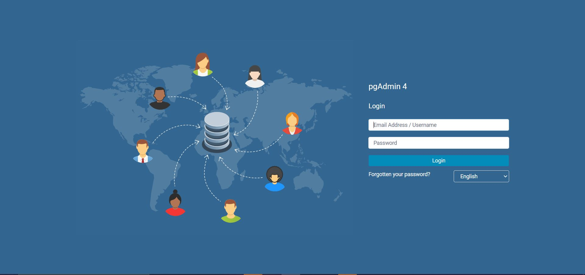
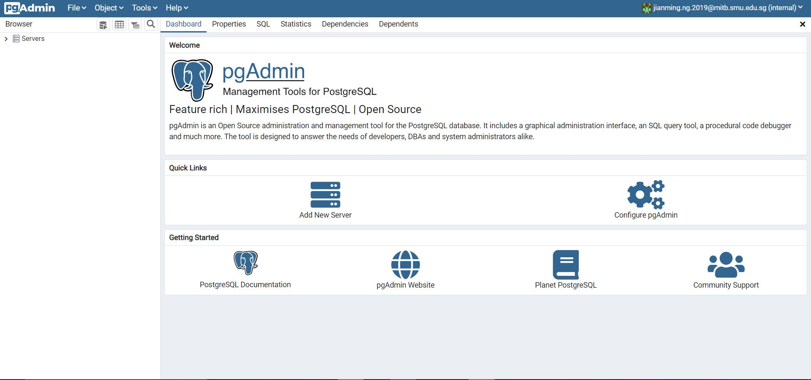
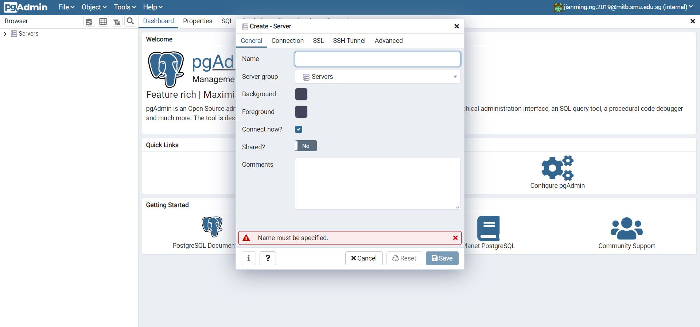
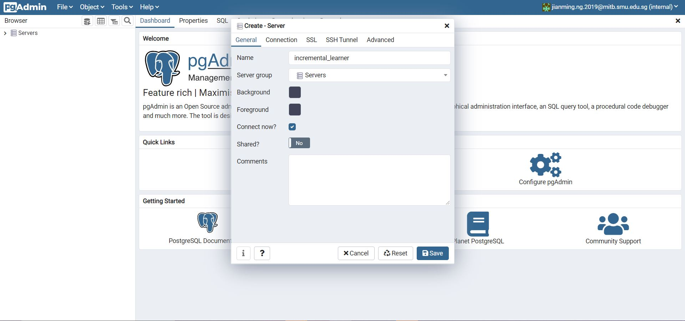
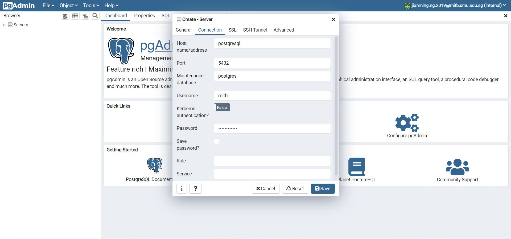
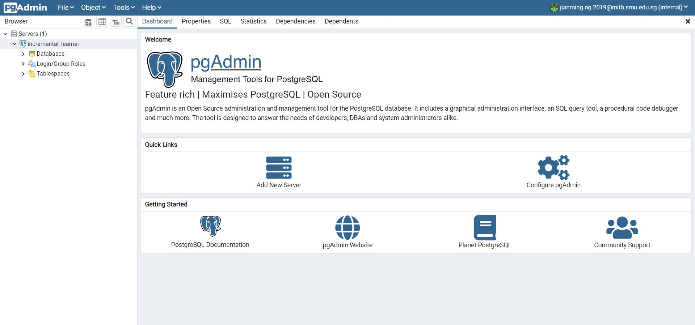
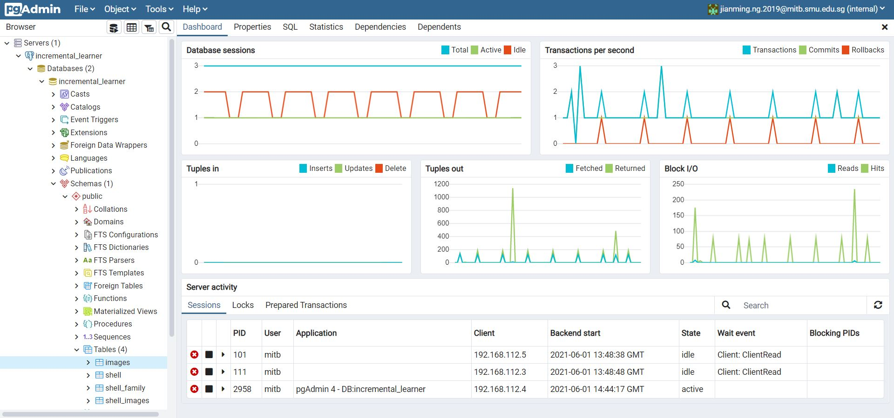
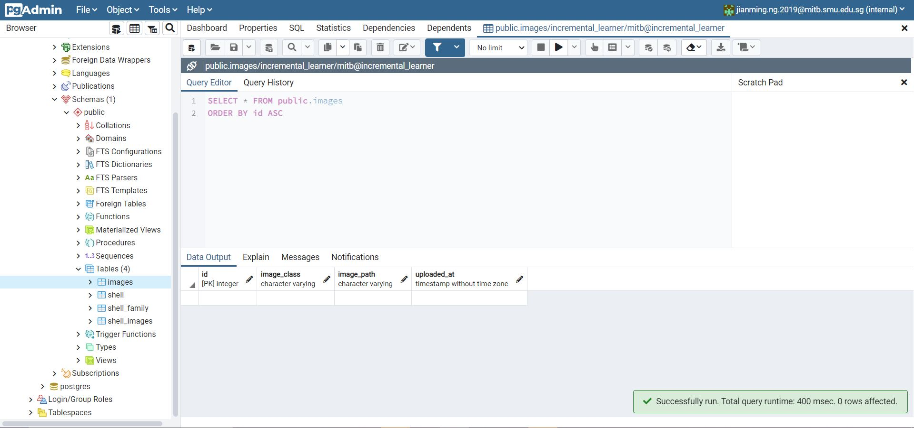

# MITB Incremental Learner Capstone Project

## **UPDATE**
Admin function has been added. Simply add the path '/admin' to go to the admin page. New function are as follows:
1) Authentication has been added for '/admin' and 'remove-class'. To change the username/password pair, simply go to server.py and edit the variable **VALID_USERNAME_PASSWORD_PAIRS**.

2) Added admin page. Main function for now allows easy reset of shell_family for the current shell_family_id. Uploaded images **will not be deleted**. However, all associated images to the shells and the shell family for the shell_family_id will be removed from the database. 'images' table will not have any edits too.

3) Added increased instances and state tracking for task_app. This is to facilitate api request to perform certain task from dash to the task_app. 

4) **NEW**: State passing from backend to frontend is implemented! Now a toast will indicate if backend is updating and if update is successful, it will display a success toast. Failure to update will also indicate a failed toast. STATE_DICT at backend is updated to track this logic.


## 1. Overview
This is a project from SMU MITB to build an incremental learner system. The idea is to have a system where it can be quickly updated and also be expanded upon the original classes easily.

## 2. Folder Structure
The project folder structure is as follows:
```
+---apps: directory where the dash app components are stored
|  +---add_class.py : Page to add zip file of new class to model
|  +---classification.py: Page to perform classification based on current model
|  +--error.py: Error page to show if user navigates to wrong url
|  +---home.py: Home page to show on loading app
|  \---remove_class.py: Deleting a class from the model
|
+---assets: CSS and images for web app is stored here
|
+---data: For training purposes and exploration. Not to be confused with images which is the folder where images are stored for production
|
+---dockerfiles: The folder containing the dockerfiles of the 2 applications
+---docs: For any miscellaneous stuffs like image to use for README or documents.
+---images: The main production folder to store any images from application
| 
+---logs: Logfiles storage for the 2 applications
|
+---models: Mainly for training purposes which does uses the pickle file storage method
+---nginx: Basic nginx configuration to be stored
+---notebooks: Any exploratory notebooks to be stored here
| 
+---postgresql_data: Database data storage folder. DO NOT DELETE on production.
|
+---sql_app: Database helper files
|   +---crud.py: CRUD operations functions
|   +---database.py: Basic configuration and initialisation of database connection
|   +---models.py: Database table structure creation
|   \--schemas.py: Schema for the tables in models.py
|
+---src
|   +---shell.py: Old version that uses file storage for model parameters
|   +---shell_v2.py: Main shell family and shell model file. Used for dash application
|   \---utils.py: Helper functions to use in shell.py or shell_v2.py
```


## 3. Brief Architecture Overview
This incremental_learner system has a total of 5(4 if Windows due to issues mounting Window's docker daemon to nginx container) dockers. The services (based on the naming in the docker-compose.yml without any edits) are as follows:
1. nginx-proxy: Reverse proxy to direct users' requests.
2. dash: Dash app which is the main frontend application users will use.
3. task-app: Flask app that runs update model task on an interval basis.
4. postgresql: Postgres Database Server
5. pgadmin: PostGres Databaase Viewer.

The reason for this architecture (in particular having a dash and task-app) is to separate the heavy workload from the dash frontend application so that it is more responsive. Hence, any feature processing (with the exception of the classification section as there is a need for the feature extractor model to perform inference to extract the features before classifying) is done on the task-app itself. The updatess will then be pushed to the database which the dash application will periodically check to pull the updates.

## 4. How to run
1. Edit the config in the **config.yaml** file based. The description of each config field are as follows:

dash_environment:
  - host: IP Address to host the dash application.
  - port: Port to serve the dash application. Note that the port defined here will need to match the docker's port specified later when running the docker.
  - debug: To run dash application in debug mode.
  - use_cpu: To expose GPU or not for tensorflow's model inference.
  - save_image_directory: Location to store uploaded images.
  - log_filepath: Path to store log file for dash application.

task_app_environment:
  - host: IP Address to host the task-app application.
  - port: Port to serve the task-app application. Note that the port defined here will need to match the docker's port specified. 
  - debug: To run task-app application in debug mode.
  - use_cpu: To expose GPU or not for tensorflow's model inference.
  - seconds_interval: How many sceonds to execute update model task.
  - log_filepath: Path to store log file for task-app application.

database:
  - username: Database server username (Higly recommended to encrypt this properly).
  - password: Database server password (Higly recommended to encrypt this properly).
  - host: Host name of database. For docker compose, set to container name as host.
  - port: Port exposed for database (Default should be 5432).
  - database_name: Name of database to connect to.

model:
  - shell_family_id: ID in database or to be created for shell_family.
  - feature_extractor_model: The model architecture used to generate the features for the incremental learner. Can only be **resnet50**, **vgg16** or **mobilenet**.
  - batch_size: Batch size to perform inference for the feature extractor model.
  - target_size: Image size to be resized to.
  - threshold: Threshold to consider a correct classification. This is a distance metric threshold not a probabilistic one.

2. Simply call the following command to create and start all dockers:
```
docker compose up --build
```
3. Open the application in your localhost via the following link:
```
localhost:<host_port>
```
You should be able to see the home page of the incremental learner application.

4. To teardown all the dockers, simple call the following command:
```
docker compose down
```
**Note: If user desires to run back the same dockers for all services (no rebuilding needed), simply call this command instead:**
```
docker compose up
```

## 5. Set up database viewer
To view the data easier, it would be beneficial to actuall set up the database viewer for convenience. The steps are as follows:
1. Upon starting the docker compose, head to the **host-name:port** for the pgadmin docker on the browser. The following window should be seen.


2. Key in the details and login to the pgAdmin4 portal. The login details are set at the docker-compose.yml (unless you are running default). You should be able to see the following page.


3. Click on 'Add New Server' in the 'Quick Links' section. The following modal (pop-up) should appear.


4. Enter the name in the current tab under the **'Name'** section. Then click on the **'Connection'** tab and enter the name of host in the **'Host'** field (this should be the docker's container name for the database server) as well as the username and password in the **'Username'** and **'Password'** field. The 4 fields exlcuding the host which is the container name that requires entry should all have been defined in the docker-compose.yml unless running default or running in production in which needs to be secure and manually added outside of the docker build steps.



5. On clicking the **'Save'** button, the added server should be updated as seen on the left under the **'Servers'** section


6. Click on **'Database'** followed by the **name of the database** specified in the docker-compose.yml for the database server (postgres container). After which, click on **'Schemas'** and finally '**'Tables'**. You should be able to see the 4 following tables: images, shell_image, shell_family, shell.


7. To view/perform any operations on the tables, simple **right click** and perform the relevant operation.


Congratulations! Database viewer has been setup successfully! Do note that any steps can be changed depending on the setup etc. This is just an out-of-the-box example.

## 6. Database Tables Overview
As mentioned, there are 4 tables present in the this system. The schemas for them are as follows:

1. images 
- Stores all uploaded images. Does not include assignment to shells 
- Schema:
  - id (integer, primary_key): An integer counter for number of images.
  - image_class (string/varchar): Name of the class the image belongs to.
  - image_path (string/varchar): File path to the image.
  - uploaded_at (datetime): Datetime in which the image waas added to the database.

2. shell
-  Stores parameters of each shell based on the shell _family_id
- Schema:
  - id (integer, primary_key): An integer counter for number of shells.
  - shell_family_id (string/varchar): Shell family id string. Dash application will only pull one of this id which will then pull the corresponding shell_ids present in this shell_family_id. 
  - shell_id (string/varchar): Shell id string which belongs to the shell_family_id. Considered this as the class the main model (shell_family_id) has been 'trained' on.
  - shell_mean (binary/bytea): The mean which is an array of numbers for the shell. Consider this as some form of centroid existing in an 1 x n dimension array. Stored as binary for convenience due to it being a numpy array on load.
  - num_instances (integer): Number of images that exist in this shell. Consider as number of 'images' seen by this shell.
  - noise_mean (float/double precision): The median of the 'standard deviation' from the normalized features.
  - noise_std (float/double precision): The mean of the absolute difference between the noise and the noise_mean.
  - created_at (datetime/timestamp): When the shell_id was first added to the database.
  - updated_at (datetime/timestamp): When the parameters of the shell_id was updated in the database.

3. shell_family
-  Stores parameters of the shell_family_id (does not include shell parameters).
- Schema:
  - id (integer, primary_key): An integer counter for number of shell_family_ids.
  - shell_family_id (string/varchar): Shell family id string. Dash application will only pull one of this id which will then pull the corresponding shell_ids present in this shell_family_id. 
  - feature_extractor_model (string/varchar): The model architecture used to extract the features from the raw image pixels.
  - instances (integer): Number of instances exist in the shell_family_id. It is the sum of all instances across all shells.
  - mapping (array[string/varchar]): The class_list present in the shell_family_id.
  - global_mean (binary/bytea): The array of the mean of the features which is an array. The global_mean is calculated based on all the features across all the shells.
  - created_at (datetime/timestamp): When the shell_family_id was first added to the database.
  - updated_at (datetime/timestamp): When the parameters of the shell_family_id was updated in the database.

4. shell_images
-  Stores parameters of the shell_family_id (does not include shell parameters).
- Schema:
  - id (integer, primary_key): An integer counter for number of images assign to the different shell_ids in different shell_family_id.
  - shell_family_id (string/varchar): Shell family id string. Dash application will only pull one of this id which will then pull the corresponding shell_ids present in this shell_family_id. 
  - shell_id (string/varchar): Shell id string which belongs to the shell_family_id. Considered this as the class the main model (shell_family_id) has been 'trained' on.
  - image_path (string/varchar): File path to the image.
  - image_features (binary/bytea): Array of features stored in binary which is generated after passing through the feature_extractor_model defined for the shell_family_id.
  - assigned_at (datetime/timestamp): Datetime this image path was assigned to the shell_id for the shell_family_id.

## 7. Credits
Thank you very much Prof Daniel Lin for the guidance throughout this project!